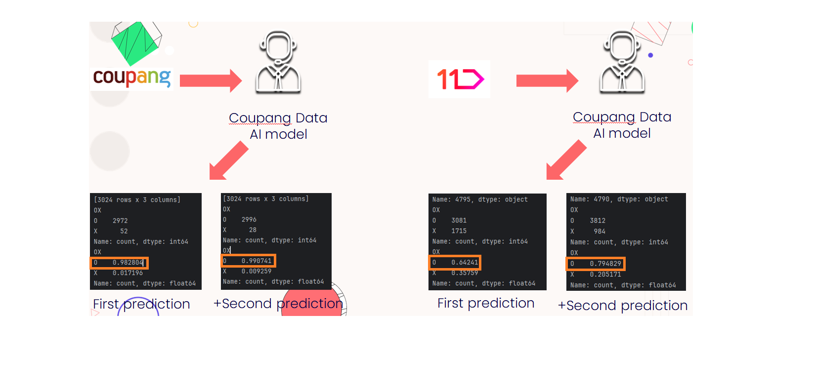

# Shoppin_category_classification
## 프로젝트 목적
타이틀만으로 어떤 카테고리의 제품인지 분류해주는 AI모델을 만듭니다. 
ex) 폴햄 스프링 페스타 티셔츠 -> 패션으로 분류, 삼성 갤럭시북4 가성비노트북 대학생 -> 디지털/가전으로 분류  
## 개발환경
Pycharm
## High Level Design

## 프로젝트 결과
### 쿠팡 데이터로 학습시킨 모델의 쿠팡 카테고리 예측과 쿠팡 데이터로 학습시킨 모델의 11번가 카테고리 예측

### 모든 웹사이트의 데이터로 학습시킨 모델의 모든 웹사이트 카테고리 예측

